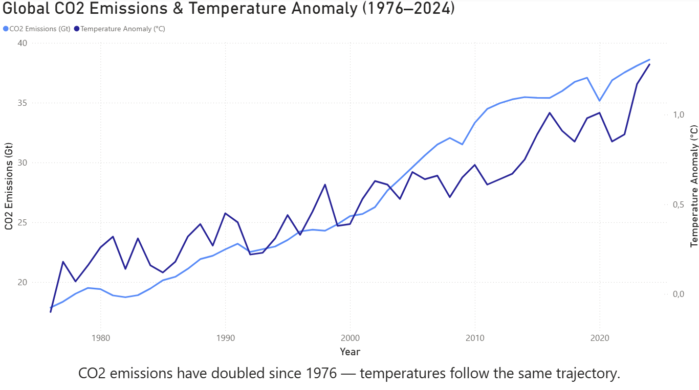
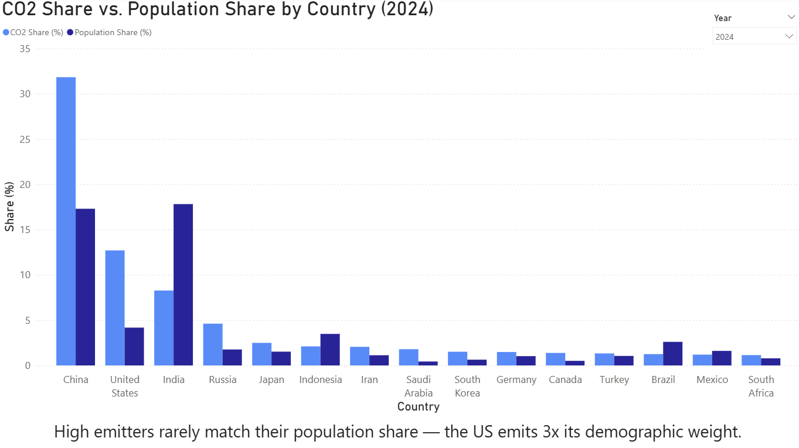
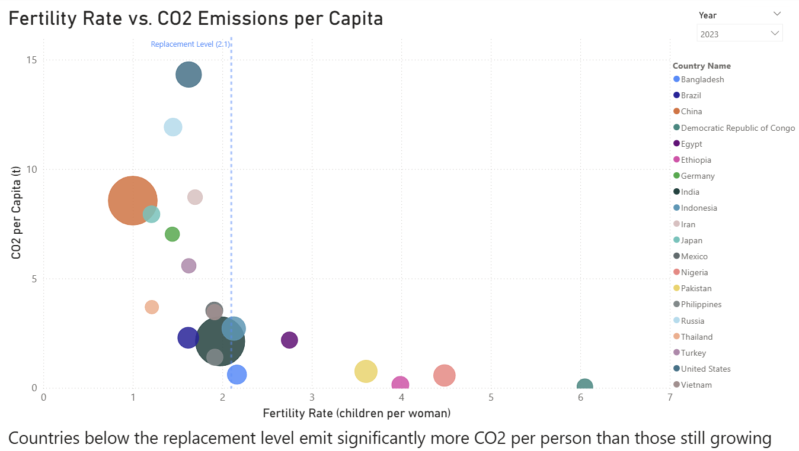

# Climate & Population Analysis

How do CO₂ emissions, economic development, and demographic change relate to global warming?

> A data analysis project combining climate, economic, and demographic data to explore the structural drivers of CO₂ emissions — developed as part of a political science class at Abendgymnasium Göttingen.

## 📸 Key Visuals

The following visuals summarize the main storyline of the project. All static screenshots are available in [`visuals/`](./visuals/) — the interactive Power BI dashboard is in [`Population_v_Climate.pbix`](./Population_v_Climate.pbix).







## 🎯 Research Question

Which countries drive global CO₂ emissions, and how do economic development and demographic change relate to carbon output?

## 🧠 Background

Climate change is often discussed in terms of global totals. But the distribution of emissions is deeply unequal — shaped by wealth, population size, and demographic trajectory.

This project explores these relationships using publicly available data, asking not just *how much* is emitted, but *by whom*, *why*, and *what the demographic future might mean* for global emissions.

## 📊 Data Sources

- **Our World in Data** — CO₂ per capita, annual CO₂ emissions, CO₂ share by country, fertility rates
- **World Bank Open Data** — GDP, GDP per capita, population, unemployment
- **NASA GISS** — Global surface temperature anomaly (baseline: 1951–1980)

## ⚙️ Methodology

- Data cleaning and merging across multiple sources using Python (pandas)
- Long-format transformation of Worldbank wide-format data
- Filtering to real countries (ISO 3-letter codes) to exclude regional aggregates
- Calculation of population share and fertility tipping points (first year below replacement level of 2.1)
- Visualization using Power BI with interactive year slicer
- SQL queries (SQLite) for exploratory analysis across joined tables

## 📈 Key Results

**CO₂ & Temperature**
Global CO₂ emissions have more than doubled since 1976 — from 18 to 38 Gt. The temperature anomaly follows the same trajectory, reaching +1.28°C above the 1951–1980 baseline in 2024.

**Who emits?**
China and the US alone account for nearly half of global CO₂ emissions. The US emits about three times its share of the global population.

**Why?**
Wealthier nations consistently emit more CO₂ per person. Higher economic development is strongly associated with higher CO₂ emissions per person.

**The demographic paradox**
Countries below the fertility replacement level (2.1) tend to emit more CO₂ per person than those still growing. The nations contributing most to the next generation emit the least.

The majority of countries have already fallen below replacement level. 
Of those still above it, almost all are in Sub-Saharan Africa or South Asia — the regions least responsible for historical emissions.

## 🔍 SQL Exploration

Beyond the dashboard, I used SQL (SQLite via DB Browser) to explore the data interactively — asking questions that are easier to express and validate through SQL.

**Decoupling: CO₂ down, GDP up**
Between 1990 and 2020, 45+ countries managed to reduce CO₂ emissions while growing their economies.

Filtering for countries already wealthy in 1990 (GDP per capita > $10k) removes many Eastern European cases, where CO₂ fell mainly due to deindustrialization after the Soviet collapse rather than climate policy.

What remains is a cleaner picture: Denmark (−47%), the UK (−46%), and Germany (−39%) lead genuine decoupling, while the US and Japan grew more but reduced far less.

**The demographic transition**
Grouping countries by GDP growth and tracking relative fertility decline reveals a non-linear pattern. Middle-income countries show the strongest relative drop (~47−49%) — the point where rising female education and urbanization accelerate fastest. Rich countries already had low fertility in 1980 and had little room left to fall.

**A methodological note on CO₂ and temperature**
A naive correlation between cumulative CO₂ and temperature anomaly yields r = 0.95 — impressive, but misleading. Both variables trend upward over decades, so they correlate automatically. Switching to first-difference analysis (year-on-year changes) drops the correlation to near zero across all tested lags. The relationship is real, but far more complex than a single number suggests.

All queries are documented in [`sql/`](./sql/).

## ⚠️ Limitations

- CO₂ data from Our World in Data is based on production-based emissions and does not account for trade-embedded emissions
- Fertility tipping points are defined as the first year below 2.1, not a sustained period — some countries may have temporarily dipped below before recovering
- Correlation does not imply causation
- Power BI visuals are interactive and best experienced live — static screenshots lose the year slicer functionality
- The analysis is descriptive and does not model causal mechanisms between emissions, economic development, fertility, and temperature.

## 🛠️ Tools

- Python (pandas, pathlib)
- Power BI
- SQL (SQLite)
- Git / GitHub

## ⚙️ Reproducing the Analysis

All raw data must be placed in `data/raw/`. Then run:

```bash
python src/run_all.py
```

This generates all processed CSVs in `data/processed/`, ready to be loaded into Power BI.

## 🤖 Use of AI (Transparency)

AI tools were used to support structuring, wording, and parts of the code.

The core analysis, interpretation, and all decisions were developed independently.